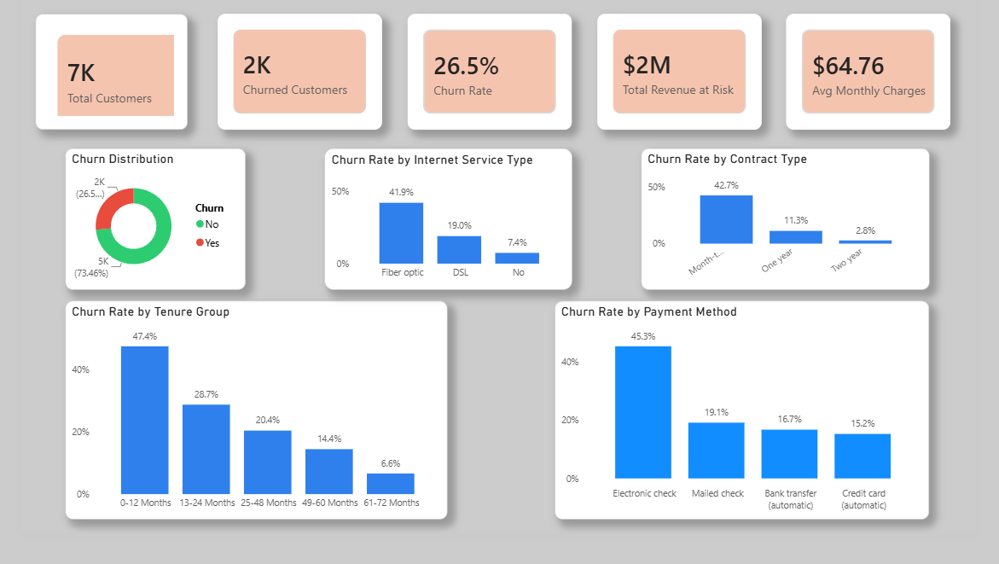
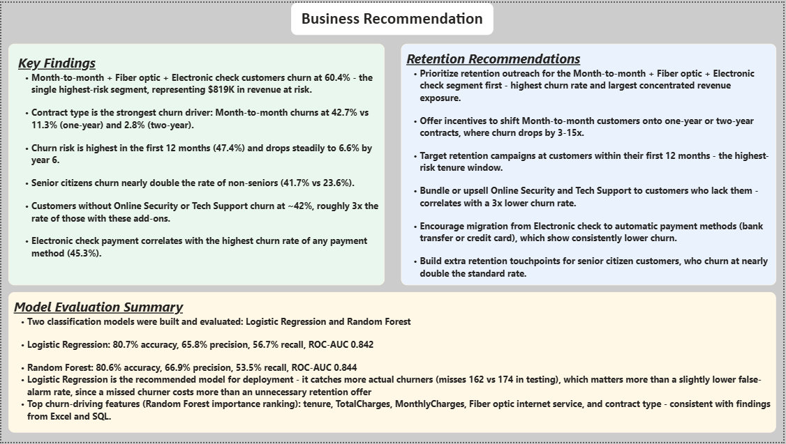
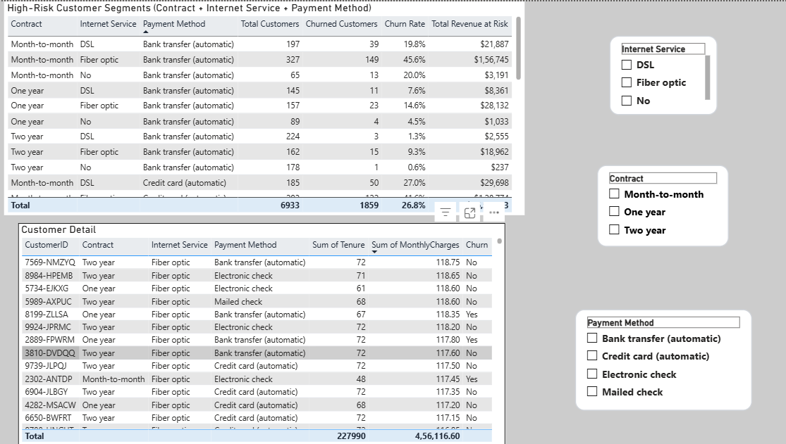
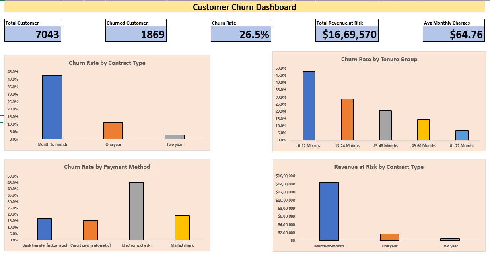
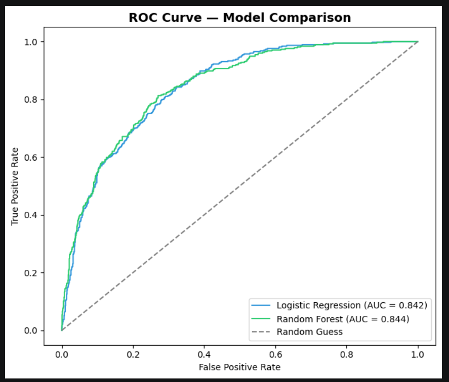
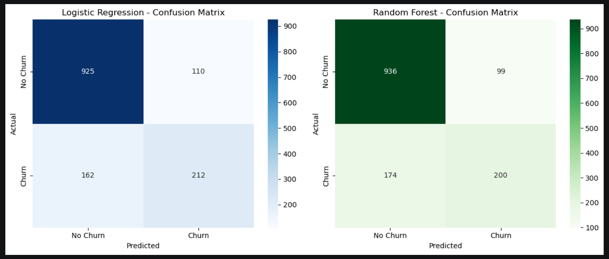
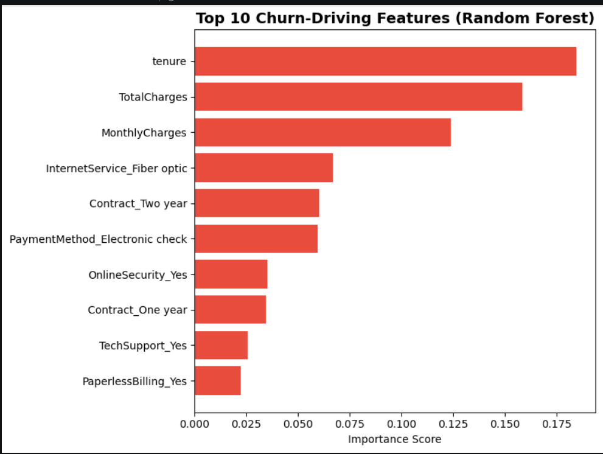

# Customer Churn Analysis & Prediction 

An end-to-end churn analytics project built to answer a question every subscription business eventually has to face: which customers are about to leave, why, and what's it costing us? I worked through the same dataset four different ways — Excel, SQL Server, Python, and Power BI — cross-checking every number along the way, then built a predictive model on top of it.

## The Business Problem

A telecom provider is losing roughly a quarter of its customer base every period, and there's no systematic way to know which segments are driving that or how much revenue is actually on the line. This project sets out to fix that: identify the real churn drivers, size the financial exposure, flag the customers worth prioritizing for retention, and build a model that can catch at-risk customers before they leave rather than after.

## Dataset

**IBM Telco Customer Churn** — 7,043 customers, 26 columns (21 original + 5 engineered).
Source: [Kaggle — blastchar/telco-customer-churn](https://www.kaggle.com/datasets/blastchar/telco-customer-churn)

Includes customer demographics, account details (contract, tenure, payment method), service subscriptions (internet, phone, security, support, streaming), billing (monthly/total charges), and churn status.

## Tools Used

- **Excel 2021** — data cleaning, pivot tables, dashboard
- **SQL Server 2019 + SSMS** — database analysis, CTEs, window functions
- **Python (Jupyter Notebook)** — EDA, feature engineering, classification models
- **Power BI Desktop** — interactive executive dashboard
- **GitHub** — version control and portfolio hosting

## Project Workflow

1. **[Excel](excel/)** — cleaned the raw dataset (fixed a text-formatted currency column, checked for duplicates), added 5 calculated fields, built pivot tables and a KPI dashboard.
2. **[SQL Server](sql/)** — loaded the cleaned data into a real database, wrote an 11-query analysis script covering aggregates, CASE statements, CTEs, and window functions, and cross-validated every KPI against the Excel numbers.
3. **[Python](python/)** — ran deeper EDA, engineered features, trained and evaluated two classification models (Logistic Regression and Random Forest), and pulled out the top churn-driving features mathematically.
4. **[Power BI](powerbi/)** — built a 3-page interactive dashboard connected live to the SQL Server database, with slicers and a dedicated recommendations page.
5. **[Reports](reports/)** — consolidated everything into a written business recommendations document.

Every KPI (total customers, churn rate, revenue at risk) came out identical across all four tools — a deliberate check, not a coincidence.

## Key Business Questions

- Which customer segments have the highest churn rate?
- What factors are most associated with customer churn?
- Which customers should the company prioritize for retention?
- How much revenue is potentially at risk from churn?
- What actionable retention recommendations should management implement?
- Can a simple model identify at-risk customers in advance?

## Dashboard Screenshots

**Power BI — Executive Overview**


**Power BI — Business Recommendations**


**Power BI — High-Risk Segments**


**Excel Dashboard**


**Python — Model Evaluation**

| ROC Curve | Confusion Matrices |
|---|---|
|  |  |

**Python — Top Churn-Driving Features**


## Key Insights

- **Contract type is the single strongest churn driver.** Month-to-month customers churn at 42.7%, versus 11.3% for one-year contracts and 2.8% for two-year contracts.
- **The first 12 months are the highest-risk window.** Churn starts at 47.4% in year one and drops steadily to 6.6% by year six.
- **One compound segment stands out above everything else:** customers on month-to-month contracts, with fiber optic internet, paying by electronic check, churn at **60.4%** — more than double the company average — and account for **$819,378** in revenue at risk on their own.
- **Fiber optic internet** churns almost as high as month-to-month contracts (41.9%) and carries the single largest revenue-at-risk figure by service type ($1.37M).
- **Electronic check** is the highest-churn payment method by a wide margin (45.3%, vs. 15-19% for every other method).
- **Security and support add-ons matter a lot.** Customers without Online Security or Tech Support churn at roughly 3x the rate of those with them.
- **Senior citizens churn at nearly double the rate of non-seniors** (41.7% vs. 23.6%). Gender showed no meaningful difference and was ruled out as a factor.

Overall churn rate across the full customer base: **26.5%**, representing **$1,669,570** in annualized revenue at risk.

## Recommendations

Full write-up with a tiered retention strategy is in [`reports/business_recommendations.md`](reports/business_recommendations.md). The short version:

1. Go after the month-to-month + fiber optic + electronic check segment first — it's the smallest group with the largest concentrated risk.
2. Incentivize contract upgrades off month-to-month plans.
3. Build a first-year retention program, since that's where most churn happens.
4. Upsell security/support add-ons — they correlate with a 3x lower churn rate.
5. Push customers off electronic check toward automatic payment methods.
6. Look into fiber optic pricing or service quality — the data flags it, but can't explain why on its own.

## Model Evaluation Summary

Two models were trained and evaluated on a held-out 20% test set:

| Metric | Logistic Regression | Random Forest |
|---|---|---|
| Accuracy | 80.7% | 80.6% |
| Precision | 65.8% | 66.9% |
| Recall | 56.7% | 53.5% |
| F1-Score | 60.9% | 59.4% |
| ROC-AUC | 0.842 | 0.844 |

Both models land in roughly the same place overall, but I went with **Logistic Regression** for deployment. It misses fewer actual churners than Random Forest (162 vs. 174 in testing), and in a churn context, missing a real churner costs more than a wasted retention offer to someone who wasn't leaving anyway — so recall mattered more here than the marginally better precision Random Forest offered.

## Folder Structure

```
customer-churn-analytics/
│
├── data/
│   ├── raw/
│   └── cleaned/
├── excel/
├── sql/
├── python/
├── powerbi/
├── images/
├── reports/
├── README.md
├── requirements.txt
└── .gitignore
```

## How to Run This Project

1. **Excel:** open `excel/customer_churn_analysis.xlsx` directly — no setup needed.
2. **SQL:** create a database in SQL Server, then run `sql/customer_churn_analysis.sql` against it.
3. **Python:**
   ```
   pip install -r requirements.txt
   jupyter notebook python/churn_analysis.ipynb
   ```
   Run the cells in order.
4. **Power BI:** open `powerbi/customer_churn_dashboard.pbix` in Power BI Desktop. You'll need to repoint the data source to your own SQL Server instance under **Transform Data → Data Source Settings**.

## Skills Demonstrated

- Data cleaning and validation (handling text-formatted numbers, structural missing data, duplicate checks)
- Excel: pivot tables, calculated fields, KPI dashboard design
- SQL: aggregate functions, CASE statements, CTEs, window functions (`RANK()`), multi-table-style segment analysis
- Python: EDA, feature engineering, classification modeling (Logistic Regression, Random Forest), model evaluation (precision/recall/F1/ROC-AUC), feature importance analysis
- Power BI: DAX measures, interactive slicers, multi-page dashboard design
- Cross-tool data validation — every KPI confirmed independently across 4 platforms
- Business communication: translating model output and statistical findings into a prioritized, actionable retention strategy

